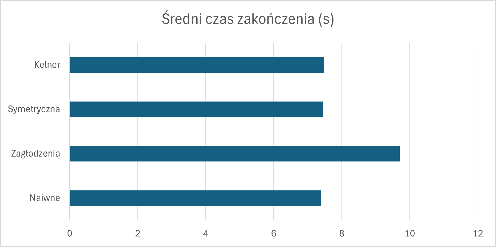
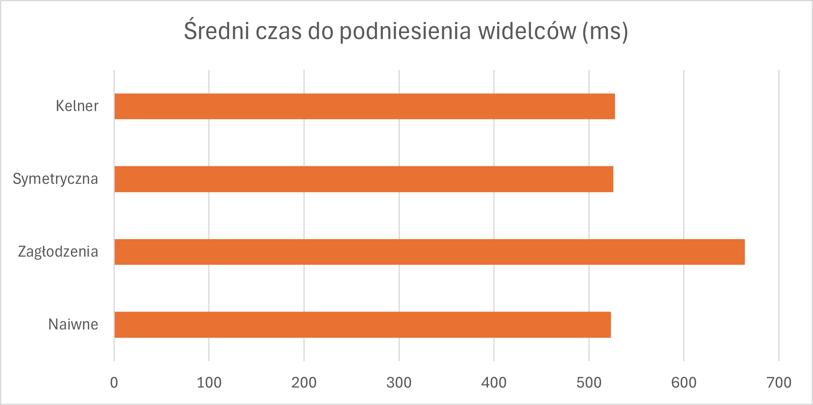

# Porównanie rozwiązań problemu 5 filozofów

---

## Wstęp

Do rozwiązania problemu filozofów został stworzony program w języku `Java`. Dokłądny kod został załączony z przesłanymi plikami.
Program implementuje cztery różne podejścia do rozwiązania problemu 5 filozofów, które zostaną omówione poniżej.

- #### Podejście 1: Metoda Naiwna

Każdy filozof podnosi najpierw prawy widelec, a następnie lewy. To podejście jest proste, ale może prowadzić do zakleszczenia, gdy wszyscy filozofowie podniosą prawy widelec jednocześnie i będą czekać na lewy.

- #### Podejście 2: Metoda Zagłodzenia

Każdy filozof sprawdza czy dostępne są oba widelce przed podniesieniem któregokolwiek z nich. Jeśli oba widelce są dostępne, filozof je podnosi i zaczyna jeść. W przeciwnym razie, filozof odkłada widelec i próbuje ponownie później. To podejście zapobiega zakleszczeniu, ale może prowadzić do zagłodzenia, gdy niektórzy filozofowie nigdy nie będą mieli dostępu do obu widelców.

- #### Podejście 3: Metoda symetryczna

Pary filozofów starają się ubiegać o ten sam widelec w tym samym czasie. Na przykład, filozof 1 i filozof 2 będą próbować podnieść widelec 1, a filozof 3 i filozof 4 będą próbować podnieść widelec 3. To podejście zapobiega zakleszczeniu, ale nadal może prowadzić do zagłodzenia.

- #### Podejście 4: Metoda z kelnerem

Filozofowie oczekują na moment gdy kelner pozwoli im jeść. Kelner kontroluje dostęp do widelców i pozwala tylko trzem filozofom jeść jednocześnie. To podejście zapobiega zarówno zakleszczeniu, jak i zagłodzeniu, ponieważ kelner zarządza dostępem do zasobów.

---

## Symulacja

Do przeprowadzenia testów powstał kod umożliwiający symulacje działania każdego z podejść. Każdy filozof w symulacji wykonuje cykl myślenia i jedzenia przez określony czas. 

Czas myślenia: `Random(0, 1000) ms` 

Czas jedzenia: `100 ms`

W czasie jednej symulacji każdy filozof stara się zjeść **10** posiłków.  Dodatkowo zostały napisane skrypty testowe w folderze `iterativeModels`, które uruchamiają każdą z metod **10000** razy i zwracają informację o:

- `średnim czasie zakończenia całego cyklu 10 posiłków`
- `średnim czasie do podniesienia obu widelców od momentu ich odłożenia`.

---

## Wyniki symulacji

Zapisane wyniki symulacji wyniosły:

| Podejście                | Średni czas zakończenia (ms) | Średni czas do podniesienia widelców (ms) |
|-------------------------|------------------------------|-------------------------------------------|
| Metoda Naiwna           | 7393                         | 523.269                                   |
| Metoda Zagłodzenia      | 9699                         | 663.964                                   |
| Metoda Symetryczna      | 7456                         | 525.833                                   |
| Metoda z Kelnerem       | 7483                         | 527.279                                   |
---

Wyniki zostały naniesione na wykresy słupkowe:

---

## Analiza wyników

#### Czas zakończenia

Przyglądając się ogólnemu czasowi trwania testów można zauważyć, że metoda Naiwna, Symetryczna oraz z Kelnerem dały bardzo zbliżone wyniki, podczas gdy metoda Zagłodzenia okazała się być znacznie wolniejsza. 

Można to tłumaczyć faktem, że w metodzie Zagłodzenia filozofowie często muszą odkładać widelce i ponawiać próby ich podniesienia, co wydłuża czas oczekiwania na zjedzenie posiłku.

#### Czas oczekiwania na widelce

Podobnie jak w przypadku czasu zakończenia, metoda Zagłodzenia wykazała się najdłuższym czasem oczekiwania na podniesienie widelców. W przeciwieństwie do innych metod, gdzie filozofowie mogli podnosić widelce niemal natychmiast po ich odłożeniu, w metodzie Zagłodzenia musieli często czekać na dostępność obu widelców, co zwiększało czas oczekiwania.

---

## Wnioski

Analizując wyniki symulacji, można stwierdzić, że metoda Zagłodzenia jest najmniej efektywnym podejściem do rozwiązania problemu 5 filozofów, zarówno pod względem czasu zakończenia, jak i czasu oczekiwania na widelce.

Stosowanie metody naiwnej jest ryzykowne ze względu na możliwość zakleszczenia, jednak w praktyce okazała się być jedną z najszybszych metod w tej symulacji.

Metody Symetryczna oraz z Kelnerem wykazały się podobną efektywnością, oferując dobre wyniki bez ryzyka zakleszczenia czy zagłodzenia.

Dodawanie mechanizmów synchronizacji jest bardzo dobrą praktyką, ale trzeba pamiętać, żę ma to swoje konsekwencje w postaci wydłużenia czasu oczekiwania i zakończenia operacji. (Nawet jeśli w tym przypadku różnice nie były bardzo duże).