# Zadanie 1

Wymyślić własną maszynę stanów, zasymulować przykład i dokonać analizy grafu osiągalności oraz niezmienników.

---

## Zamodelowana Sieć

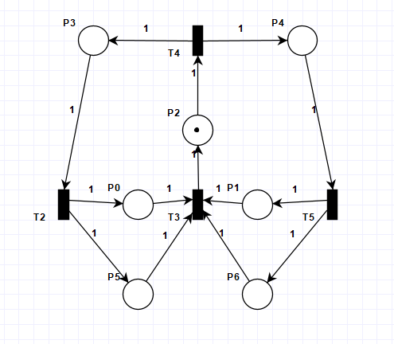

Sieć ta została zaprojektowana w celu modelowania systemu współbieżnego, w którym Centralny Kontroler $P2$ i $T3$ inicjuje dwa niezależne, równoległe zadania $T2$ i $T5$. Jej główną funkcją jest testowanie mechanizmu wzajemnego wykluczania i wymuszonej synchronizacji $T4$ dla poprawnego zakończenia cyklu pracy.

## Analiza Grafu Osiągalności

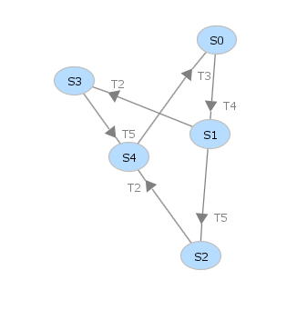

Analiza Grafu Osiągalności dowiodła, że sieć jest **żywa**, co oznacza, iż każda tranzycja może zostać odpalona z każdego osiągalnego stanu, eliminując ryzyko deadlocku. Sieć jest również **ograniczona**, ponieważ nie występują stany z nieskończoną liczbą tokenów, co gwarantuje stabilność systemu.

## Analiza Niezmienników

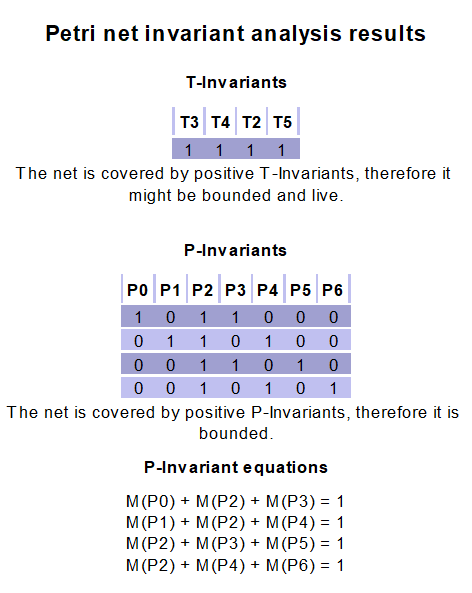

$T-Niezmiennik$ potwierdza cykliczność i regularność pracy systemu (każda operacja musi wykonać się raz na cykl) 

$P-Niezmienniki$ dowodzą bezpieczeństwa sieci, gwarantując stałą sumę tokenów w kluczowych miejscach. Oznacza to, że system skutecznie realizuje wzajemne wykluczanie i jest ograniczony, zapobiegając utracie tokenów lub ich niekontrolowanemu namnażaniu się.

---

# Zadanie 2

Zasymulować siec jak poniżej:

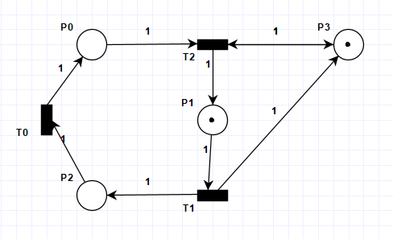

Dokonać analizy niezmienników przejść.Jaki wniosek można wyciągnąć o odwracalności sieci? Wygenerować graf osiągalności.
- Proszę wywnioskować z grafu, czy siec jest żywa.
- Proszę wywnioskować czy jest ograniczona.

---

## Przykładowa symulacja (20 kroków)

```
Initial Marking
T1
T0
T2
T1
T0
T2
T1
T0
T2
T1
T0
T2
T1
T0
T2
T1
T0
T2
T1
T0
```

Sieć na końcu symulacji:

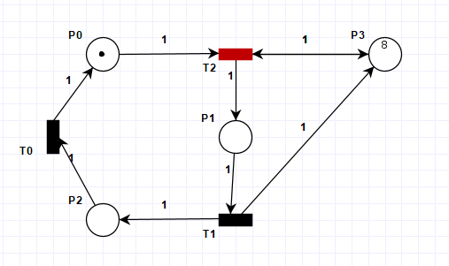

Po zakończeniu symulacji możemy zobaczyć, żę w P3 znajduje się 8 znaczników.

## Analiza Niezmienników

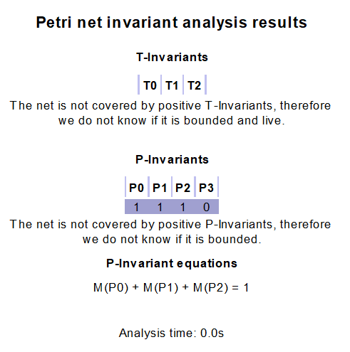

Brak $T-Niezmienników$ świadczy o tym, że sieć nie jest odwracalna i nie jest w stanie powrócić do stanu początkowego.

$P-Niezmienniki$, w których $P3$ ma wartość zero, potwierdzają, że miejsce to jest **nieograniczone**, ponieważ jego oznakowanie stale rośnie i nie jest kontrolowane przez żadną stałą sumę tokenów.

## Graf Osiągalności

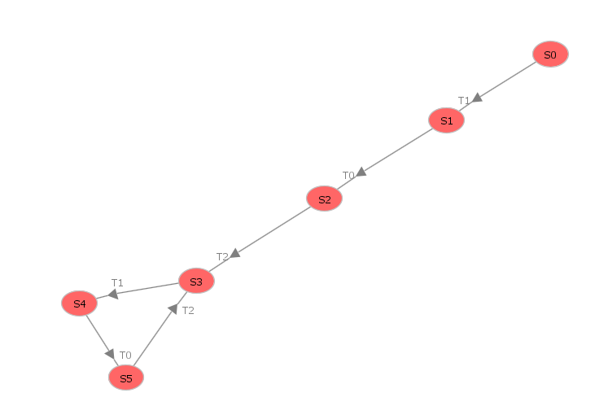

Graf Osiągalności jest nieskończony, ponieważ żaden stan się nie powtarza z uwagi na funkcję sieci jako licznika. Ciągły wzrost tokenów w miejscu $P3$ uniemożliwia powrót do wcześniejszego oznakowania.

> Graf na rysunku jest uproszczony, ponieważ program `PIPE` nie rysuje nieskończonych grafów

## Czy sieć jest ograniczona?

Nie. Sieć nie jest ograniczona ponieważ w $P3$ znaczniki rosną w nieskończoność.

---

# Zadanie 3

- Zasymulować wzajemne wykluczanie dwóch procesów na wspólnym zasobie. 

- Dokonać analizy niezmienników miejsc oraz wyjaśnić znaczenie równań(P-invariant equations). 

- Które równanie pokazuje działanie ochrony sekcji krytycznej?

---

## Zamodelowana Sieć

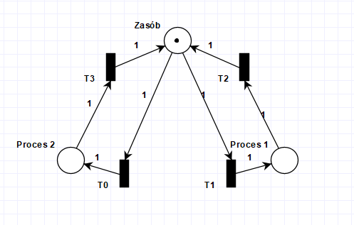

## Przykładowa Symulacja (10 kroków)

```
Initial Marking
T1
T2
T1
T2
T1
T2
T1
T2
T0
T3
```

Sieć na końcu symulacji:


## Analiza P-Niemzienników

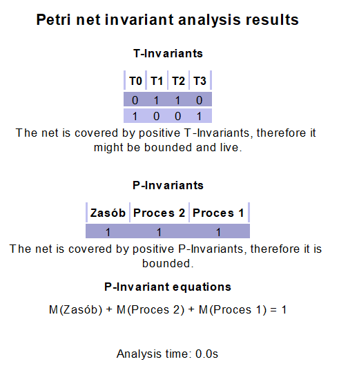

Istnienie równania dla całego układu gdzie łączna suma znaczników jest równa 1 dowodzi, że nie ma możliwości nadprodukowania zasobu. Co więcej zasób nie może być zajęty przez oba procesy na raz (a na tym polega polega ochrona sekcji krytycznej)

---

# Zadanie 4

- Uruchomić problem producenta i konsumenta z ograniczonym buforem

- Dokonać analizy niezmienników. 

- Czy siec jest zachowawcza? 

- Które równanie mówi nam orozmiarze bufora?

---

## Zamodelowana Sieć

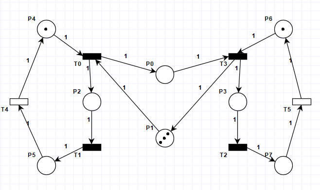

## Niezmienniki

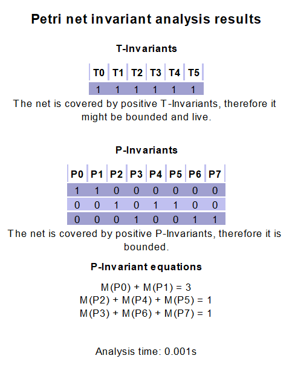

Sieć modeluje bezpieczny i żywy system Producenta-Konsumenta z buforem o pojemności 3. Niezmienniki dowodzą, że zarówno operacje są cykliczne, jak i alokacja zasobów (zarówno bufora, jak i kontroli nad procesami) jest ściśle kontrolowana i ograniczona.

## Czy sieć jest zachowawcza?

Tak, sieć jest zachowawcza, ponieważ z `P-Ivariant Equations` wiemy, że ilość tokenów w maszynie jest znana i nie zmienna (nigdzie nie tworzymy ani nie usuwamy tokenów)

## Które równanie mówi nam o rozmiarze bufora?

```
M(P0) + M(P1) = 3
```

---

# Zadanie 5

- Stworzyć symulacje problemu producenta i konsumenta z nieograniczonym buforem. 
- Dokonać analizy niezmienników. 
- Zaobserwować brak pełnego pokrycia miejsc.

---

## Zamodelowana Sieć

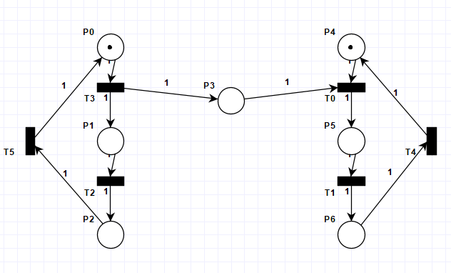

## Przykładowa Symulacja (25 kroków)

```
Initial Marking
T3
T2
T5
T0
T3
T1
T2
T4
T0
T1
T4
T5
T3
T0
T1
T4
T2
T5
T3
T0
T1
T4
T2
T5
T3
```

Sieć na końcu symulacji:

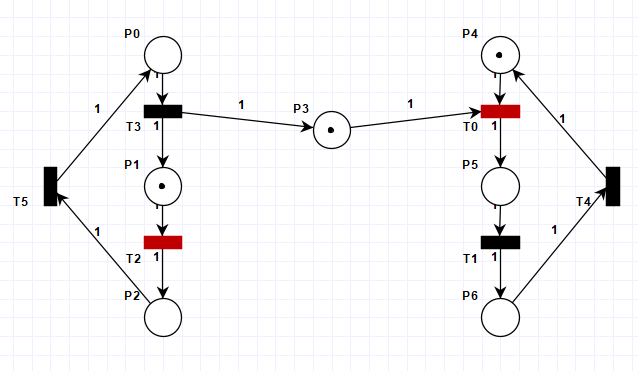

## Analiza niezmienników

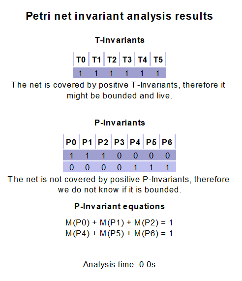

Możemy zsaobserwować brak pełnego pokrycia miejsc wynikający z faktu, że w elemencie P3 nie jesteśmy w stanie określić ilości występujących tam elementów co sprawia że ten element oraz w efekcie cała sieć jest nieograniczona.

---

# Zadanie 6

- Zasymulować prosty przykład ilustrujący zakleszczenie. 
- Wygenerować graf osiągalności i zaobserwować znakowania z których nie można wykonać przejść. 
- Zaobserwować właściwości sieci w ”State Space Analysis”

---

## Zamodelowana Sieć

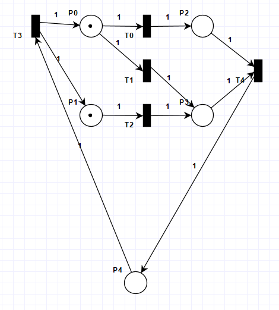

W tym przykładzie oba procesy wymagają zasobu w celu dalszego działanmia. Istnieje jednak możliwość zajęcia obydwu dostępnych zasobów przez jeden proces co blokuje dalsze kroki.

## Symulacja przykłądu z Deadlockiem

```
Initial Marking
T0
T2
T4
T3
T1
T2
```

Stan sieci po symulacji:

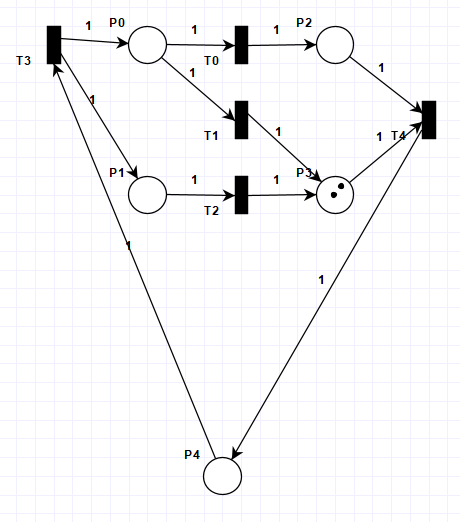

## Graf osiągalności

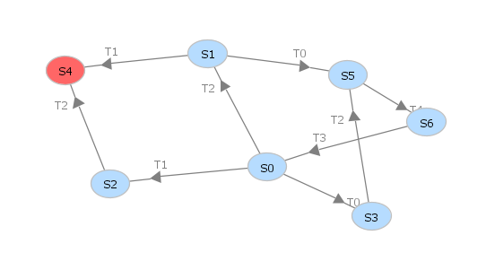

Wierzchołek grafu oznaczony jako $S4$ to stan w którym następuje zablokowanie. Jeden proces czeka na zasób, którego już nie ma, ponieważ został zajęty.

## Analiza przestrzeni stanów

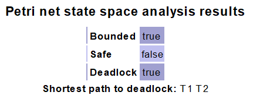

W przedstawinej sieci możliwe jest uzyskanie dwóch znaczników na raz w punkcie $P3$, w związku z tym sieć nie jest bezpieczna. 

Oczywiście zgodnie treścią zadania w stworzonej sieci istnieje możliwość zakleszczenia.


